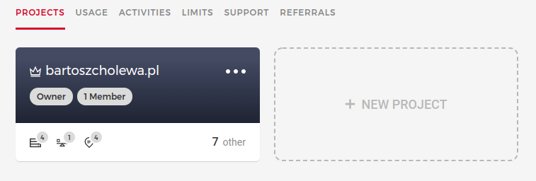
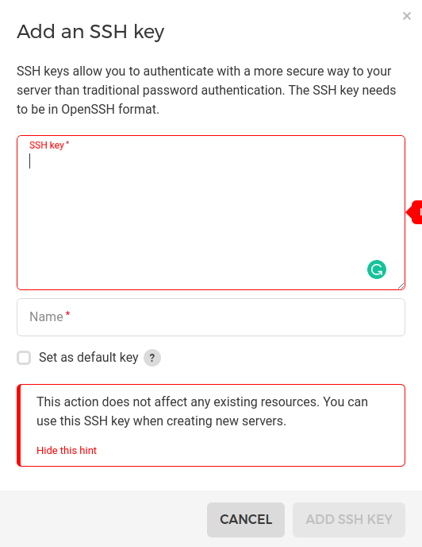
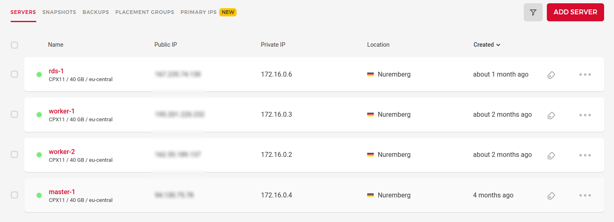
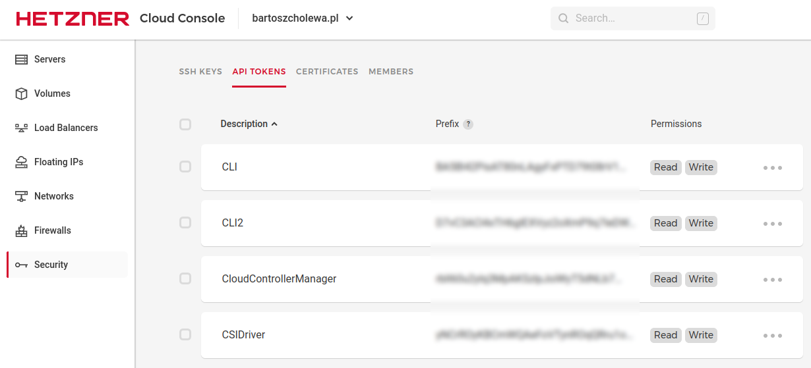

# Bartosz Cholewa Managment CI/CD

***

# Deployment Guide

1. Test Django
2. Build container
3. Push container to GitHub
4. Update secrets
5. Update deployment
6. Wait rollout to finish
7. Migrate database

***

Kubernetes Commands:

```console
# Get commands with basic output
kubectl get services                          # List all services in the namespace
kubectl get pods --all-namespaces             # List all pods in all namespaces
kubectl get pods -o wide                      # List all pods in the current namespace, with more details
kubectl get deployment my-dep                 # List a particular deployment
kubectl get pods                              # List all pods in the namespace
kubectl get pod my-pod -o yaml                # Get a pod's YAML
```

***

## 1. Server deployment - Hetzner

#### Install a Kubernetes-Cluster on Hetzner Cloud

### 1.1 Register to [Hetzner Cloud](https://accounts.hetzner.com/login)

### 1.2 Create new [project](https://console.hetzner.cloud/projects)



### 1.3 Add SSH keys to project



### 1.4 Add MASTER server to project:

1. Location: **Nuremberg**
2. Image: **Ubuntu 20.04**
3. Type: **Standard**
4. Servers: **CPX11** or greater
5. Volume: **None**
6. Networking: **Public IPv4**, **Public IPv6**, **Private networks**
7. Private Networks:
    1. Name: **kubernetes**
    2. IP Range: **172.16.0.0/16
8. Firewalls: **None**
9. Additional features: **Placement group**
10. Placement group:
    1. Type: **Spread**
    2. Name: **placement-group-1**
11. SSH Keys: **Previosly created**
12. Name: **master-1**

### 1.5 Repeat step **1.4.** for creating **worker-1**, **worker-2** and **rds-1**



### 1.6 Create Hetzner API Tokens



***

## 2. Initialize fresh servers with Ansible

### 2.1 Create inventory host

```shell
cp ansible/inventory/bartoszcholewa.pl.example ansible/inventory/bartoszcholewa.pl
```

### 2.2 Update IP addresses to Hetzner servers

`ansible/inventory/bartoszcholewa.pl`

```text
[masters]
master-1 ansible_host=<MASTER-1_IP> ansible_user=root

[workers]
worker-1 ansible_host=<WORKER-1_IP> ansible_user=root
worker-2 ansible_host=<WORKER-2_IP> ansible_user=root

[databases]
rds-1 ansible_host=<RDS-1_IP> ansible_user=root
```

### 2.3 Run Ansible Playbooks

```shell
/bin/bash /ansible/deploy_fresh.sh
```